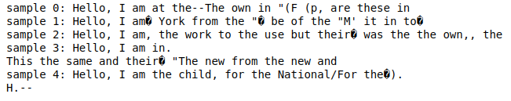

# GPT-2 from Scratch in Python

This project implements GPT-2 from scratch in Python, following the [Andrej Karpathy's tutorial](https://www.youtube.com/watch?v=l8pRSuU81PU). The structure and training scripts were modified to train the model on a personal GPU (GTX 960) with the flexibility to scale across multiple GPUs.

## Table of Contents
- [Project Structure](#project-structure)
- [Features](#features)
- [Installation](#installation)
- [Training](#training)
- [Usage](#usage)
- [Model Performance](#model-performance)
- [Acknowledgments](#acknowledgments)

## Project Structure
```bash
GPT2_from_scratch/
├── gpt2_from_scratch/               # Core project folder containing model, data loaders, and utilities
│   ├── Block.py                     # Transformer block definition
│   ├── CausalSelfAttention.py        # Self-attention mechanism
│   ├── DataLoader.py                # Data loader for training and validation datasets
│   ├── edu_fineweb10B               # Training dataset folder
│   ├── edu_fineweb10B.py            # Dataset-specific processing script
│   ├── GPTConfig.py                 # Configuration class for GPT model
│   ├── GPT.py                       # GPT model implementation
│   ├── hellaswag                    # Hellaswag dataset for evaluation
│   │   └── hellaswag_val.jsonl       # Sample validation data
│   ├── hellaswag.py                 # Script for Hellaswag evaluation
│   ├── helper.py                    # Utility functions for training/evaluation
│   ├── __init__.py                  # Init file for package
│   ├── log                          # Logs and saved models
│   │   ├── log.txt                  # Training log
│   │   └── model_00100.pt           # Model checkpoint
│   ├── MLP.py                       # Feed-forward MLP block
│   └── train_gpt2.py                # Main training script
├── input.txt                        # Sample text input for testing the model
├── notebooks/                       # Jupyter Notebooks for testing and experimentation
│   ├── play.ipynb                   # Notebook to interact with the model and run tests
│   ├── testing.ipynb                # Notebook for model evaluation
│   └── Untitled.ipynb               # Unused notebook
├── poetry.lock                      # Poetry lock file (dependency management)
├── pyproject.toml                   # Project configuration file (dependencies, settings)
├── README.md                        # Project documentation (this file)
└── tests/                           # Test scripts
    └── __init__.py
```

## Features

- **Custom GPT-2 Implementation**: The GPT-2 model is implemented from scratch using PyTorch.
- **Modular Codebase**: Code is structured into modules for easier maintenance and extension.
- **Support for Multiple GPUs**: The training script (`train_gpt2.py`) can scale across multiple GPUs.
- **Model Checkpointing**: The model saves checkpoints for easy resumption of training.

## Installation

1. **Clone the repository**:
   ```bash
   git clone https://github.com/Mkoek213/GPT2_from_scratch.git
   cd GPT2_from_scratch
   ```
2. **Install dependencies**:
   ```bash
   poetry install
   ```
3. **Prepare your dataset**:
   ```bash
   Make sure your dataset is in the gpt2_from_scratch/edu_fineweb10B/ folder, or modify the paths accordingly in the train_gpt2.py script.
   ```

## Training

To train the model, you can use the provided train_gpt2.py script. For single GPU training:
```bash
python gpt2_from_scratch/train_gpt2.py
```
For multi-GPU training (example with 1 process per node):
```bash
torchrun --standalone --nproc_per_node=1 gpt2_from_scratch/train_gpt2.py 
```
This will start the training process. Logs and model checkpoints will be saved in the gpt2_from_scratch/log/ directory.

## Usage
Once you've trained the model, you can test it using the notebooks/play.ipynb file. In this notebook, you can pass your own text and evaluate the model's performance on it.

Simply open the notebook, provide a prompt, and run the cells to generate text from the model.

### Example


This screen shows the output of the model after passing the input text **"Hello, I am"**. The model generates a continuation based on this prompt.

## Model Performance
The current model performance is poor since it was trained on a single GPU (NVIDIA GTX 960) for only 11 hours. This is in stark contrast to the training setup used in Andrej Karpathy's tutorial, where the model was trained on 8 A100 GPUs for 8 hours. This significant difference in hardware and training time greatly affects the quality of the generated text.

## Acknowledgments
This project is heavily inspired by Andrej Karpathy's GPT-2 tutorial.

